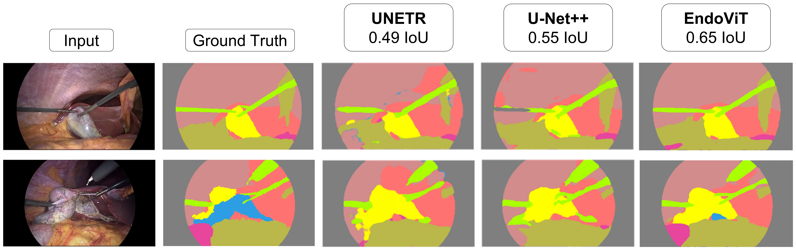

# EndoViT
Large-scale Self-supervised Pre-training of [Vision Transformers (ViT)](https://arxiv.org/abs/2010.11929) on endoscopic images.

-------------------

Official codebase of the paper: [EndoViT: pretraining vision transformers on a large collection of endoscopic images](https://link.springer.com/article/10.1007/s11548-024-03091-5?utm_source=rct_congratemailt&utm_medium=email&utm_campaign=oa_20240403&utm_content=10.1007/s11548-024-03091-5)

Earlier arXiv version (without semantic-segmentation) can be found here: [Whether and When does Endoscopy Domain Pretraining Make Sense?](https://arxiv.org/abs/2303.17636)

**Authors:** Dominik Batić, Felix Holm, Ege Özsoy, Tobias Czempiel, Nassir Navab

```
@article{batic2023whether,
  title={Whether and When does Endoscopy Domain Pretraining Make Sense?},
  author={Bati{\'c}, Dominik and Holm, Felix and {\"O}zsoy, Ege and Czempiel, Tobias and Navab, Nassir},
  journal={arXiv preprint arXiv:2303.17636},
  year={2023}
}
```

## Quick-Start

Checkout out our 🤗 <a href="https://huggingface.co/egeozsoy/EndoViT" target="_blank">Hugging Face</a> page for a guide on using EndoViT as Feature Extractor (Either Frozen or as a Backbone to be
Fine-tuned).
Alternatively you can take a look at the ```endovit_demo.py```

## Pre-trained EndoViT Checkpoints

To prevent data leakage for our evaluation, we excluded the test set for backbone training of our segmentation, action triplet recognition, and surgical phase recognition tasks, respectively. You can find the weights for each of these versions of the backbone below.

| Excluded Data (Test Sets)                  | Checkpoint                                                                                           |
|--------------------------------------------|------------------------------------------------------------------------------------------------------|
| CholecSeg8k (Segmentation)                 | [EndoViT_Seg](https://drive.google.com/file/d/1NJ-4ZL40kHA_WZ1NylahaS84FcvnigjF/view?usp=share_link) 
| CholecT45 (Action Triplet Detection)       | [EndoViT ATD](https://drive.google.com/file/d/1NReHXlMiBkVJiZcuJAGx6sGWh7pNgg_i/view?usp=share_link) 
| Cholec80 (Surgical Phase Recognition)      | [EndoViT_SPR](https://drive.google.com/file/d/1NK8aMb9SaApCn_vLigyDSn3aTI55QVT1/view?usp=share_link) 

Use these checkpoints if you wish to skip EndoViT's pre-training.


## Introduction
The development of novel Computer Vision (CV) methods in the medical field has been largely constrained by the lack of publicly available annotated data. Patient data and recorded surgical procedures are hard to obtain. They are considered highly sensitive information and therefore protected by numerous laws. Even the annotation procedure is complicated, often requiring the involvement of multiple medical experts.

Consequently, public medical datasets are scarce, and the existing ones contain far fewer annotated images than the CV datasets used for the same task. Pre-training has been shown as a viable strategy to mitigate the downsides of training on small datasets. However, most medical works use models pre-trained on natural images, creating a domain gap between pre-training and fine-tuning.

In this work, we explore the possibilities of pre-training models specifically for the use in endoscopic domain. To this end, we turn to Vision Transformers. Given the extreme number of parameters they contain, a large amount of data is needed to properly train them. Therefore, self-supervised pre-training strategies were developed, splitting the use of Transformers into two parts. First, a Transformer is pre-trained using a large collection of raw unlabelled data to produce a model with a general understanding of the underlying domain. Afterwards, the resulting model is fine-tuned for a specific downstream task. This can now be done with significantly less labelled data.

## Project Description
The fact Vision Transformers can be pre-trained using raw data only prompted us to combine the existing smaller medical datasets into a larger collection. To this end, we introduce Endo700k, a collection of 9 publicly available endoscopic datasets comprising more than 700,000 unlabelled images. The overview of the included datasets is given in the table below.

### Endo700k dataset collection
| # | Dataset                 | # Images  |
|:-:|:-----------------------:|----------:|
| 1 | [HeiCo][1]              |   347,257 |
| 2 | [Cholec80][2]           |   184,498 |
| 3 | [PSI-AVA][3]            |    73,618 |
| 4 | [ESAD][4]               |    49,544 |
| 5 | [LapGyn4 (v1.2)][5]     |    38,192 |
| 6 | [hSDB-instrument][6]    |    35,576 |
| 7 | [DSAD][7]               |    13,195 |
| 8 | [GLENDA (v1.0)][8]      |     1,083 |
| 9 | [SurgicalActions160][9] |       761 |
| - | **Total**               |**743,724**|

[1]: https://www.synapse.org/#!Synapse:syn21903917/wiki/601992
[2]: https://github.com/CAMMA-public/TF-Cholec80
[3]: http://157.253.243.19/PSI-AVA/
[4]: https://saras-esad.grand-challenge.org/download/
[5]: http://ftp.itec.aau.at/datasets/LapGyn4/index.html
[6]: https://hsdb-instrument.github.io/
[7]: https://springernature.figshare.com/articles/dataset/The_Dresden_Surgical_Anatomy_Dataset_for_abdominal_organ_segmentation_in_surgical_data_science/21702600
[8]: http://ftp.itec.aau.at/datasets/GLENDA/v1_0/index.html
[9]: http://ftp.itec.aau.at/datasets/SurgicalActions160/index.html

Using Endo700k we pre-train a Vision Transformer model following [Masked Autoencoder (MAE)](https://github.com/facebookresearch/mae) approach. An input image is divided into equally-sized patches and a large proportion of them (75%) is masked out. The transformer is then tasked with reconstructing the missing input. Although a simple concept, it represents a challenging self-supervised task that induces a comprehensive understanding of observed objects and scenes. Afterwards, the pre-trained ViT model can be fine-tuned as a feature extraction backbone on various downstream tasks. We visualize the pre-training and fine-tuning procedure in the following image.

<p align="center">
  
</p>

Finally, we evaluated EndoViT's performance on three downstream tasks:
- Semantic Segmentation on the CholecSeg8k dataset,
- Action Triplet Detection on the CholecT45 dataset and
- Surgical Phase Recognition on the Cholec80 dataset.

We primarily compare EndoViT's performance to its ImageNet pre-trained ViT counterpart.

-------------------
## Usage
**1) Clone the repository:**
```bash
git clone https://github.com/DominikBatic/EndoViT.git endovit
cd endovit
```
- **NOTE:** We have organized the repo so that everything should be run from the root ("endovit") directory.
### Requirements:
**2) Copy our "endovit" conda environment:**
```
conda env create -f conda_environment.yml
conda activate endovit
```
-------------------
### Download Endo700k:
-------------------
- **NOTE: By downloading any of the datasets you agree to the terms of their use. Please check the corresponding LICENCEs.**

**3) Download Cholec80 ([GitHub](https://github.com/CAMMA-public/TF-Cholec80)) ([LICENSE](https://github.com/CAMMA-public/TF-Cholec80/blob/master/LICENSE)) ([Request Form](https://docs.google.com/forms/d/1GwZFM3-GhEduBs1d5QzbfFksKmS1OqXZAz8keYi-wKI))**
- We use a slightly modified download script from the original repository ("prepare.py").
```
python ./datasets/Cholec80/download_cholec80.py --data_rootdir ./datasets/
```
- The dataset can now be found at: ```./datasets/Cholec80```.

**4) Download and Prepare the Other Datasets**
- We have written a helper script to download and pre-process all other datasets. The following command will download and remove all unnecessary data except the raw images necessary for EndoViT pre-training. If you need the full datasets, please read the use instructions at the beginning of the script.
- You will need at least 700 GB of memory to download the datasets. After pre-processing, the dataset will be around 150 GB.
- **To download HeiCo dataset, you need first to create a [Synapse Account](https://www.synapse.org/). Afterwards, pass your email and password as the arguments in the command below.**
```
python ./datasets/Endo700k/download_and_prepare_Endo700k.py --all --synapse_email YOUR_EMAIL --synapse_password YOUR_PASSWORD
```
- The datasets can now be found at ```./datasets/Endo700k```.
-------------------
### Pre-train EndoViT: 
-------------------
- Since EndoViT is a collection of diverse datasets, we wanted to specialize our pre-training towards one of them. For this reason, all our downstream tasks are conducted on the Cholec80 data (CholecT45 and CholecSeg8k are subsets of Cholec80 with different annotations). 
- To avoid data leakage, validation and test images of the downstream datasets had to be removed from the pre-training. Since Cholec80, CholecT45 and CholecSeg8k have different train/val/test splits, we decided to pre-train three models: one for each task by removing validation and test images of the corresponding downstream dataset from EndoViT's Cholec80 section.
- Additionally, we created a validation dataset consisting of only Cholec80 images. We frequently evaluate our pre-trained models on it and save the best-performing ones, which implicitly assigns a higher weight to the Cholec80 images during pre-training.

**5) Prepare Cholec80**
- The following script prepares three different subvariants of Cholec80. Each one will be used to pre-train EndoViT for different downstream task.
- Additionally, it creates the pre-training validation dataset.

```
python ./datasets/Cholec80/prepare_cholec80.py
```
- The datasets can now be found at: ```./datasets/Endo700k``` under: ```Cholec80_for_Segmentation```, ```Cholec80_for_ActionTripletDetection``` and ```Cholec80_for_SurgicalPhaseRecognition```.
- The validation dataset can now be found at: ```./datasets/validation_dataset/Cholec80_for_Validation```.

**6) Download ImageNet Pre-trained Weights**
- Endo700k images were extracted at 1 FPS. Therefore, they aren't entirely independent, making the dataset in practice much smaller than it is.
- Consequently, our pre-training uses ImageNet weights as a starting point.

a) ImageNet weights for pre-training (encoder-decoder weights):
```
wget -O ./pretraining/mae/ImageNet_pretrained_models/mae_pretrain_vit_base_full.pth https://dl.fbaipublicfiles.com/mae/pretrain/mae_pretrain_vit_base_full.pth
```
b) ImageNet weights for fine-tuning (encoder weights):
```
wget -O ./pretraining/mae/ImageNet_pretrained_models/mae_pretrain_vit_base.pth https://dl.fbaipublicfiles.com/mae/pretrain/mae_pretrain_vit_base.pth
```
**7) Run the pre-training**
- By default, we use wandb for logging in all scripts. If you wish to use it as well, please make a [WandB account](https://wandb.ai/site).
- Afterwards, log into your wandb account in the current shell, or alternatively, set WANDB_API_KEY shell variable as your wandb authorization key which you can find [here](https://wandb.ai/authorize).
- You can disable the logging, but you will need to do so in each script.

a) Run Pre-training for Semantic Segmentation
```
source ./pretraining/pretrained_endovit_models/EndoViT_for_Segmentation/pretrain_script
```
- Best checkpoint will be saved at: ```./pretraining/pretrained_endovit_models/EndoViT_for_Segmentation/endovit_seg.pth```

b) Run Pre-training for Action Triplet Detection
```
source ./pretraining/pretrained_endovit_models/EndoViT_for_ActionTripletDetection/pretrain_script
```
- Best checkpoint will be saved at: ```./pretraining/pretrained_endovit_models/EndoViT_for_ActionTripletDetection/endovit_ATD.pth```

c) Run Pre-training for Surgical Phase Recognition
```
source ./pretraining/pretrained_endovit_models/EndoViT_for_SurgicalPhaseRecognition/pretrain_script
```
- Best checkpoint will be saved at: ```./pretraining/pretrained_endovit_models/EndoViT_for_SurgicalPhaseRecognition/endovit_SPR.pth```

-------------------
### Pre-trained Checkpoints:
-------------------

- In case you wish to skip the pre-training, you can download our checkpoints [here](#pre-trained-endovit-checkpoints).
- Simply place the checkpoints where the best pretraining checkpoints would have been saved in the section <br>```7) Run the pre-training```.
- **Note:** In this case, you should still perform step ```6) Download ImageNet Pre-trained Weights```.

-------------------
### Fine-tune EndoViT:
-------------------
- As noted earlier, we fine-tune EndoViT on three downstream tasks: Semantic Segmentation, Action Triplet Detection and Surgical Phase Recognition.
- On each task, we use a Vision Transformer (ViT) as a feature extraction backbone. We compare the results when the backbone was initialized with EndoViT weights (```EndoViT```), ImageNet weights (```ImageNet```) and when training from stratch (```NoPretraining```). Additionally, for Action Triplet Detection and Surgical Phase Reconition, we test the performance of a ResNet50 backbone pre-trained on ImageNet.
- For each task, we first train all models with the full training dataset (```Full Dataset Experiments```). We then assess their performance when trained on only a subset of the train set (```Few-shot Learning Experiments```).
- We always perform 3 runs for each model in each setting and report mean and standard deviation of the corresponding metric.

### Semantic Segmentation:
- We use [Dense Prediction Transformer (DPT)](https://github.com/isl-org/DPT) as the underlying architecture for the task. It is an encoder-decoder model designed for dense prediction. However, it has a Vision Transformer encoder instead of the more standardly used CNN.

**8) Download CholecSeg8k dataset (3 GB)**
- First, download the dataset from Kaggle ([CholecSeg8k](https://www.kaggle.com/datasets/newslab/cholecseg8k?resource=download)). You will require a Kaggle account to do so.
- After downloading, you will have a file named ```archive.zip```. Rename it to ```CholecSeg8k.zip``` and place it at ```./datasets/CholecSeg8k```.
- Unzip the archive to ```./datasets/CholecSeg8k/data``` with the following command:
```
unzip -uqq ./datasets/CholecSeg8k/CholecSeg8k.zip -d ./datasets/CholecSeg8k/data
```

**9) Pre-process CholecSeg8k dataset**
- We wrote a short description of the CholecSeg8k structure [here](additional_README_files/CholecSeg8k.txt). We also discuss all the pre-processing details in it.
- In short:
a) We correct some mistakes in the dataset.
b) Instead of using the original watershed and colour masks provided by CholecSeg8k, we create an additional "ground truth mask".
c) To compare our results to other architectures, we follow the pre-processing and training procedure of this [benchmark](https://ieeexplore.ieee.org/document/9871583). Most importantly, we downsample the original 13 classes to 8 by combining several classes into one.
 
- Pre-process CholecSeg8k by running:
```
python ./datasets/CholecSeg8k/utils/preprocess_CholecSeg8k_multi_process.py \
    --data_dir ./datasets/CholecSeg8k/data \
    --output_dir ./datasets/CholecSeg8k/data_preprocessed \
    --cpu_count 8
```
- Since the pre-processing takes a long time, we wrote a multi-process script. ```--cpu_count``` is the number of processes to spawn.

**10) Create a Relative Paths file (RP_file)**
- We load CholecSeg8k with a custom dataloader. To do so we require a ```.csv``` file with relative paths from the CholecSeg8k's root folder to each of its images.
- Create the RP_file using the following command:

```
python ./datasets/CholecSeg8k/utils/create_RP_file_for_CholecSeg8k.py \
    --data_dir ./datasets/CholecSeg8k/data_preprocessed \
    --output_dir ./datasets/CholecSeg8k/data_preprocessed
```
- The ```.csv``` file can now be found at: ```./datasets/CholecSeg8k/data_preprocessed/RP_CholecSeg8k.csv```

**11) Full Dataset Experiments**
- On the Semantic Segmentation task, we tested both with lower resolution input and higher resolution input.
- Each script will perform 3 runs on different seeds. We always use the same 3 fixed seeds: 1665, 8914 and 37.

- To reproduce our results, run the following scripts:

a) Low Res - EndoViT's pre-training resolution (224 x 224)
```
-------------- EndoViT -------------
source ./finetuning/semantic_segmentation/output_dir/low_res/full_dataset/EndoViT/hyperparam_script

------------- ImageNet -------------
source ./finetuning/semantic_segmentation/output_dir/low_res/full_dataset/ImageNet/hyperparam_script

----------- NoPretraining ----------
source ./finetuning/semantic_segmentation/output_dir/low_res/full_dataset/NoPretraining/hyperparam_script
```

b) High Res - resolution used in the benchmark paper (256 x 448)
```
-------------- EndoViT -------------
source ./finetuning/semantic_segmentation/output_dir/high_res/full_dataset/EndoViT/hyperparam_script

------------- ImageNet -------------
source ./finetuning/semantic_segmentation/output_dir/high_res/full_dataset/ImageNet/hyperparam_script

----------- NoPretraining ----------
source ./finetuning/semantic_segmentation/output_dir/high_res/full_dataset/NoPretraining/hyperparam_script
```
- All outputs will be saved in the same folder as the corresponding script.

#### We report the following Full Dataset Results (metric: mean IoU):

<div align="center">

|          | ViT NoPretraining  | ViT ImageNet       | EndoViT            |
|:--------:|:------------------:|:------------------:|:------------------:|
| Low Res  | 51.70% ± 0.54%     | 62.45% ± 0.90%     | **65.05% ± 0.67%** |
| High Res | 53.18% ± 1.20%     | 63.40% ± 0.81%     | **65.32% ± 0.56%** |

</div>

#### Qualitative Full Dataset Results:

Compared to the ImageNet pre-trained model, EndoViT has more globally consistent outputs (highlighted in black). Furthermore, it is significantly better at reconstructing instruments' tips (highlighted in red).

<p align="center">
  
</p>

Compared to the results introduced in the following [benchmark](https://ieeexplore.ieee.org/document/9871583), EndoViT outperforms other Transformers (UNETR) as well as various CNN architectures (including the best performing U-Net++).

<p align="center">
  
</p>

**12) Few-shot Learning Experiments**
- Few-shot experiments are always performed by training on a fixed number of training videos. In the case of CholecSeg8k dataset, on 1, 2 or 4 out of in total 13 training videos.
- Each script will perform 3 runs on different video subsets. We always use the same fixed video subsets: [Few-shot Learning Subsets](./finetuning/semantic_segmentation/output_dir/LessTrainingData.txt)

- To reproduce our results, run the following scripts:

a) Low Res - EndoViT's pre-training resolution (224 x 224)
```
-------------- EndoViT -------------
source ./finetuning/semantic_segmentation/output_dir/low_res/less_training_data/EndoViT/1_vid_only/hyperparam_script
source ./finetuning/semantic_segmentation/output_dir/low_res/less_training_data/EndoViT/2_vids_only/hyperparam_script
source ./finetuning/semantic_segmentation/output_dir/low_res/less_training_data/EndoViT/4_vids_only/hyperparam_script

------------- ImageNet -------------
source ./finetuning/semantic_segmentation/output_dir/low_res/less_training_data/ImageNet/1_vid_only/hyperparam_script
source ./finetuning/semantic_segmentation/output_dir/low_res/less_training_data/ImageNet/2_vids_only/hyperparam_script
source ./finetuning/semantic_segmentation/output_dir/low_res/less_training_data/ImageNet/4_vids_only/hyperparam_script

----------- NoPretraining ----------
source ./finetuning/semantic_segmentation/output_dir/low_res/less_training_data/NoPretraining/1_vid_only/hyperparam_script
source ./finetuning/semantic_segmentation/output_dir/low_res/less_training_data/NoPretraining/2_vids_only/hyperparam_script
source ./finetuning/semantic_segmentation/output_dir/low_res/less_training_data/NoPretraining/4_vids_only/hyperparam_script
```

b) High Res - resolution used in the benchmark paper (256 x 448)
```
-------------- EndoViT -------------
source ./finetuning/semantic_segmentation/output_dir/high_res/less_training_data/EndoViT/1_vid_only/hyperparam_script
source ./finetuning/semantic_segmentation/output_dir/high_res/less_training_data/EndoViT/2_vids_only/hyperparam_script
source ./finetuning/semantic_segmentation/output_dir/high_res/less_training_data/EndoViT/4_vids_only/hyperparam_script

------------- ImageNet -------------
source ./finetuning/semantic_segmentation/output_dir/high_res/less_training_data/ImageNet/1_vid_only/hyperparam_script
source ./finetuning/semantic_segmentation/output_dir/high_res/less_training_data/ImageNet/2_vids_only/hyperparam_script
source ./finetuning/semantic_segmentation/output_dir/high_res/less_training_data/ImageNet/4_vids_only/hyperparam_script

----------- NoPretraining ----------
source ./finetuning/semantic_segmentation/output_dir/high_res/less_training_data/NoPretraining/1_vid_only/hyperparam_script
source ./finetuning/semantic_segmentation/output_dir/high_res/less_training_data/NoPretraining/2_vids_only/hyperparam_script
source ./finetuning/semantic_segmentation/output_dir/high_res/less_training_data/NoPretraining/4_vids_only/hyperparam_script

```
- All outputs will be saved in the same folder as the corresponding script.

#### We report the following Few-shot Learning Results (metric: mean IoU):

<div align="center">

| **Low Res**      |**ViT NoPretraining** | **ViT ImageNet**     | **EndoViT**          |
|:----------------:|:--------------------:|:--------------------:|:--------------------:|
| 1 Video Only     | 29.11% ± 2.94%       | 38.35% ± 8.27%       | **40.95% ± 10.32%**  |
| 2 Videos Only    | 36.28% ± 5.06%       | 50.36% ± 2.71%       | **54.02% ±  4.18%**  |
| 4 Videos Only    | 43.29% ± 0.96%       | 54.17% ± 2.35%       | **57.87% ±  2.70%**  |
| **High Res**     |**ViT NoPretraining** | **ViT ImageNet**     | **EndoViT**          |
| 1 Video Only     | 26.66% ± 6.64%       | 39.06% ± 5.17%       | **41.16% ± 10.75%**  |
| 2 Videos Only    | 35.69% ± 4.45%       | 50.14% ± 4.48%       | **56.05% ±  5.73%**  |
| 4 Videos Only    | 44.16% ± 0.75%       | 56.22% ± 1.52%       | **59.81% ±  3.27%**  |

</div>

### Action Triplet Detection:
- In the Action Triplet Detection task, the goal is to detect actions performed by a surgeon in every frame of a surgical procedure. Importantly, the actions need to be expressed as a triplet of the form:
<p align="center">
  <b>&lt; Instrument, Verb, Target &gt;</b>.
</p>

- Where ```Verb``` is the action performed using a surgical ```Instrument``` on a ```Target``` anatomical structure.

- We build our code upon the [Rendezvous (RDV)](https://github.com/CAMMA-public/rendezvous/tree/main) model, designed specifically for the task. The task itself is described in more detail in RDV repository.
- In the end, we haven't successfully integrated ViT into RDV. Therefore, we test using a simple model consisting of a feature extraction backbone (either ResNet50 or ViT) and a single linear layer.
  
**13) Download CholetT45 dataset (150 GB)**
- Fill out the CholecT45 request form [here](https://github.com/CAMMA-public/cholect50/blob/master/docs/README-Downloads.md) to obtain the dataset.
- Save the dataset under ```./datasets/CholecT45```
- ```CholecT45``` folder should include ```data``` subfolder containing the raw images and annotation subfolders: ```triplet```, ```instrument```, ```verb``` and ```target```.

**14) Full Dataset Experiments**
- Each script will perform 3 runs on different seeds. We always use the same 3 fixed seeds: 1665, 8914 and 37.

- To reproduce our results, run the following scripts:

```
##########  ViT Backbone  ##########

-------------- EndoViT -------------
source ./finetuning/action_triplet_detection/output_dir/full_dataset/ViT_backbone/EndoViT/training_script

------------- ImageNet -------------
source ./finetuning/action_triplet_detection/output_dir/full_dataset/ViT_backbone/ImageNet/training_script

----------- NoPretraining ----------
source ./finetuning/action_triplet_detection/output_dir/full_dataset/ViT_backbone/NoPretraining/training_script

##########  CNN Backbone  ##########

------------- ResNet50 -------------
source ./finetuning/action_triplet_detection/output_dir/full_dataset/ResNet50_backbone/training_script
```
- All outputs will be saved in the same folder as the corresponding script.

#### We report the following Full Dataset Results (metric: mean Average Precision - mAP):

<div align="center">

| ResNet50           | ViT NoPretraining  | ViT ImageNet       | EndoViT            |
|:------------------:|:------------------:|:------------------:|:------------------:|
| 22.13% ± 1.37%     | 13.93% ± 0.43%     | 27.84% ± 0.39%     | **30.17% ± 0.01%** |

</div>
    
**15) Few-shot Learning Experiments**
- Few-shot experiments are always performed by training on a fixed number of training videos. In the case of CholecT45 dataset, on 2, 4 or 8 out of in total 31 training videos.
- Each script will perform 3 runs on different video subsets. We always use the same fixed video subsets: [Few-shot Learning Subsets](./finetuning/action_triplet_detection/output_dir/LessTrainingData.txt)
 
- To reproduce our results, run the following scripts:

```
##########  ViT Backbone  ##########

-------------- EndoViT -------------
source ./finetuning/action_triplet_detection/output_dir/less_training_data/ViT_backbone/EndoViT/training_script

------------- ImageNet -------------
source ./finetuning/action_triplet_detection/output_dir/less_training_data/ViT_backbone/ImageNet/training_script

----------- NoPretraining ----------
-> Since the results of training from scratch in Full Dataset Experiment were significantly worse, we skip this training.

##########  CNN Backbone  ##########

------------- ResNet50 -------------
source ./finetuning/action_triplet_detection/output_dir/less_training_data/ResNet50_backbone/training_script
```
- All outputs will be saved in the same folder as the corresponding script.

#### We report the following Few-shot Learning Results (metric: mean Average Precision - mAP):

<div align="center">

|                  |**ResNet50**          | **ViT ImageNet**     | **EndoViT**          |
|:----------------:|:--------------------:|:--------------------:|:--------------------:|
| 2 Videos Only    | 10.88% ± 0.50%       | 12.22% ± 1.78%       | **17.59% ±  2.94%**  |
| 4 Videos Only    | 12.37% ± 1.78%       | 14.27% ± 1.73%       | **18.52% ±  2.28%**  |
| 8 Videos Only    | 17.01% ± 1.75%       | 19.71% ± 0.61%       | **21.91% ±  0.12%**  |

</div>

### Surgical Phase Recognition:
- Surgical Phase Recognition is a classification task in which a model takes a surgical video stream and labels each frame with the surgical phase it belongs to.
- We build our code upon the [TeCNO](https://github.com/tobiascz/TeCNO) model. TeCNO employs a two-stage approach to perform Surgical Phase Recognition. In the first stage, a simple model consisting of a feature extraction backbone and a single linear layer predicts phase labels by taking individual frames as input. Afterwards, a Multi-Stage Temporal Convolution Network (MS-TCN) refines the predictions using temporal context. The second stage is independent of the first, meaning MS-TCN can refine the predictions of any backbone network.
- We compare the performance of the ViT and ResNet50 backbone.

**16) Full Dataset Experiments**
- Each script will perform 3 runs on different seeds. We always use the same 3 fixed seeds: 1665, 8914 and 37.

- To reproduce our results, run the following scripts:

```
##########  ViT Backbone  ##########

-------------- EndoViT -------------
source ./finetuning/surgical_phase_recognition/output_dir/full_dataset/ViT_backbone/EndoViT/training_script

------------- ImageNet -------------
source ./finetuning/surgical_phase_recognition/output_dir/full_dataset/ViT_backbone/ImageNet/training_script

----------- NoPretraining ----------
source ./finetuning/surgical_phase_recognition/output_dir/full_dataset/ViT_backbone/NoPretraining/training_script

##########  CNN Backbone  ##########

------------- ResNet50 -------------
source ./finetuning/surgical_phase_recognition/output_dir/full_dataset/ResNet50_backbone/training_script
```
- All outputs will be saved in the same folder as the corresponding script.

#### We report the following Full Dataset Results (metric: Phase Accuracy):
- Accuracy after both stages is reported.

<div align="center">

|                    | ResNet50           | ViT NoPretraining  | ViT ImageNet       | EndoViT            |
|:------------------:|:------------------:|:------------------:|:------------------:|:------------------:|
| Stage 1            | 79.84% ± 0.30%     | 59.21% ± 0.36%     | **82.94% ± 0.69%** | 82.60% ± 1.26%     |
| Stage 2            | 87.84% ± 0.58%     | 73.42% ± 0.70%     | **89.56% ± 0.65%** | 89.37% ± 0.95%     |

</div>

**17) Few-shot Learning Experiments**
- Few-shot experiments are always performed by training on a fixed number of training videos. In the case of Cholec80 dataset, on 2, 4 or 8 out of in total 40 training videos.
- Each script will perform 3 runs on different video subsets. We always use the same fixed video subsets: [Few-shot Learning Subsets](./finetuning/surgical_phase_recognition/output_dir/LessTrainingData.txt)
 
- To reproduce our results, run the following scripts:

```
##########  ViT Backbone  ##########

-------------- EndoViT -------------
source ./finetuning/surgical_phase_recognition/output_dir/less_training_data/ViT_backbone/EndoViT/training_script

------------- ImageNet -------------
source ./finetuning/surgical_phase_recognition/output_dir/less_training_data/ViT_backbone/ImageNet/training_script

----------- NoPretraining ----------
-> Since the results of training from scratch in Full Dataset Experiment were significantly worse, we skip this training.

##########  CNN Backbone  ##########

------------- ResNet50 -------------
source ./finetuning/surgical_phase_recognition/output_dir/less_training_data/ResNet50_backbone/training_script
```
- All outputs will be saved in the same folder as the corresponding script.


#### We report the following Few-shot Learning Results (metric: Phase Accuracy):
- Accuracy after both stages is reported.

<div align="center">

| **Stage 1**      |**ResNet50**          | **ViT ImageNet**     | **EndoViT**         |
|:----------------:|:--------------------:|:--------------------:|:-------------------:|
| 2 Videos Only    | 47.51% ± 1.33%       |   63.59% ± 1.07%     | **67.04% ± 2.92%**  |
| 4 Videos Only    | 57.80% ± 2.67%       |   67.72% ± 0.90%     | **71.80% ± 0.49%**  |
| 8 Videos Only    | 63.71% ± 1.48%       | **75.50% ± 0.32%**   |   75.30% ± 1.83%    |
| **Stage 2**      |**ResNet50**          | **ViT ImageNet**     | **EndoViT**         |
| 2 Videos Only    | 68.23% ± 1.10%       |   77.05% ± 1.71%     | **78.89% ± 1.26%**  |
| 4 Videos Only    | 74.50% ± 1.76%       |   80.00% ± 0.62%     | **80.28% ± 0.71%**  |
| 8 Videos Only    | 77.43% ± 1.68%       |   84.10% ± 0.38%     | **84.68% ± 1.25%**  |

</div>
